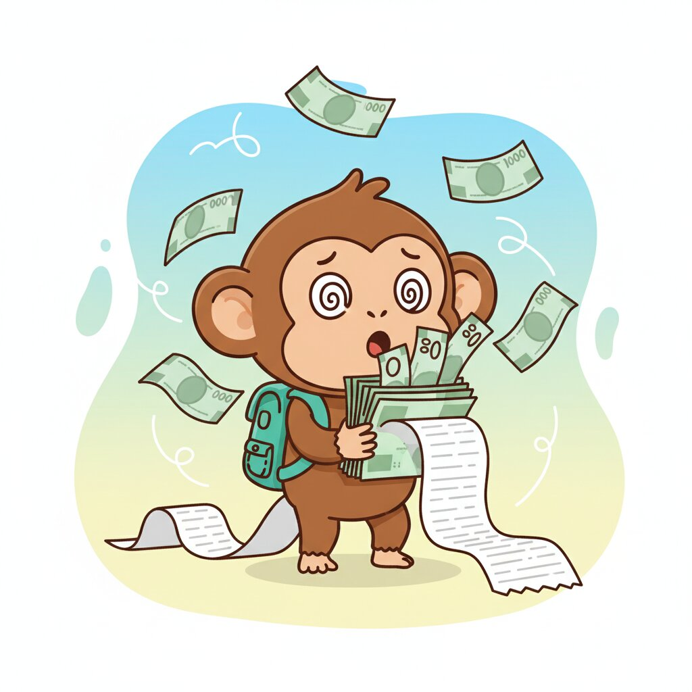

# Unit 02: Numbers, Money, & Basic Bargaining



## 1. Learning Objectives
By the end of this unit, you will be able to:
*   Count from 1 to 1,000,000 (It’s easier than you think!).
*   Understand prices and handle the Indonesian Rupiah (IDR).
*   Ask "How much is this?" naturally.
*   Bargain politely in a market setting.

## 2. Vocabulary

| Indonesian | English | Notes |
| :--- | :--- | :--- |
| **Berapa?** | How much / How many? | |
| **Harga** | Price | |
| **Uang** | Money | |
| **Mahal** | Expensive | |
| **Murah** | Cheap | |
| **Boleh** | Can / Allowed | Key word for permission. |
| **Kurang** | Less / Minus | Used to ask for a discount. |
| **Ini** | This | |
| **Itu** | That | |
| **Satu** | One | |
| **Dua** | Two | |
| **Tiga** | Three | |
| **Empat** | Four | |
| **Lima** | Five | |
| **Enam** | Six | |
| **Tujuh** | Seven | |
| **Delapan** | Eight | |
| **Sembilan** | Nine | |
| **Sepuluh** | Ten | Prefix *Se-* means "One". |
| **Ribu** | Thousand | |
| **Juta** | Million | |

> **Pro Tip:** In spoken Indonesian, "Satu" is often shortened to **"Se-"** when attached to counters.
> *   *Seribu* = 1,000 (One Thousand)
> *   *Sejuta* = 1,000,000 (One Million)

## 3. Grammar Focus

### A. The Number System (Logic > Memorization)
Indonesian numbers are very logical. Once you know 1-10, you can build the rest.

*   **11-19 (Teen):** Add **-belas**.
    ▸ 11 = *Sebelas* (Special case: not "Satu belas")
    ▸ 12 = Dua **belas**
    ▸ 13 = Tiga **belas**

*   **20-99 (Tens):** Add **puluh**.
    ▸ 20 = Dua **puluh**
    ▸ 21 = Dua **puluh** satu
    ▸ 50 = Lima **puluh**

*   **Large Numbers (Currency):**
    ▸ 100 = **Seratus** (Se + Ratus)
    ▸ 1,000 = **Seribu**
    ▸ 10,000 = Sepuluh **ribu**
    ▸ 100,000 = Seratus **ribu**
    ▸ 1,500,000 = Satu **juta** lima ratus **ribu** (Often just called "Satu setengah juta" - 1.5 million)

### B. Asking the Price
Don't say "Berapa harga ini?". It's grammatically correct but stiff.

**Natural Ways to Ask:**
1.  **"Ini berapa?"** (This is how much?) - *Most common.*
2.  **"Berapa, Bu/Pak?"** (How much, Ma'am/Sir?)

### C. The Art of Bargaining ("Boleh Kurang?")
Bargaining is expected in traditional markets (Pasar), but NOT in supermarkets or malls with fixed prices (Harga Pas).

**The Formula:**
1.  Ask price: "Ini berapa, Bu?"
2.  Express shock (playfully): "Waduh, mahal banget!" (Oh my, so expensive!)
3.  Ask for discount: **"Boleh kurang, nggak?"** (Can it be less?)
4.  Suggest price: "Lima puluh ribu, boleh?"

## 4. Dialogue: At the Souvenir Market

**Context:** Sarah wants to buy a Sarong in Bali. She talks to an older female seller (Ibu).

**Sarah:** Pagi, Bu. Kain ini berapa?
**Ibu:** Pagi, cantik (beautiful). Itu seratus lima puluh ribu. (150,000)
**Sarah:** Wah, mahal banget, Bu!
**Ibu:** Bagus lho, kualitas ekspor.
**Sarah:** **Boleh kurang, nggak?**
**Ibu:** Boleh. Mau berapa?
**Sarah:** Tujuh puluh ribu, ya? (70,000)
**Ibu:** Waduh, belum dapat, Mba. (I can't do that yet). Seratus pas, deh. (100 flat/fixed).
**Sarah:** Delapan puluh ribu deh, Bu. Saya ambil dua.
**Ibu:** Ya sudah. Delapan puluh ribu. Silakan.
**Sarah:** Makasih, Bu.

### 🎧 Listen Online

Scan to hear native pronunciation:

<p align="center">
  
</p>

<p align="center"><strong>https://indonesianbasics.com/audio#unit-02</strong></p>

### Audio Notes
1.  Note the tone. It is friendly, not aggressive.
2.  "Wah" and "Waduh" are interjections of surprise.
3.  "Deh" is a particle used to confirm or settle a deal.

## 5. Cultural Note: The Currency (IDR)
Indonesian prices look huge because of the zeros!
*   ~ $1 USD = ± Rp 15,000 (fluctuates).
*   ~ $10 USD = ± Rp 150,000.

**The "K" Shortcut:**
Locals and expats often chop off the last three zeros when talking.
*   50,000 = "Fifty K" or just **"Lima puluh"** (context implies thousands).
*   If you see "50k" on a menu, it means 50,000 Rupiah.

## 6. Exercises

### A. Vocabulary Drill

**A1. Match the Indonesian to English:**

| | Indonesian | | English |
|---|---|---|---|
| 1. | Berapa | ___ | a. Expensive |
| 2. | Harga | ___ | b. How much |
| 3. | Mahal | ___ | c. Cheap |
| 4. | Murah | ___ | d. Money |
| 5. | Uang | ___ | e. Price |

**A2. Write the numbers in Indonesian:**

1.  7 = ______________________
2.  15 = ______________________
3.  23 = ______________________
4.  50 = ______________________
5.  100 = ______________________
6.  1,000 = ______________________

---

### B. Grammar Practice

**B1. Build the number (fill in the blanks):**

1.  11 = Se______ (one + teen)
2.  14 = Empat ______ (four + teen)
3.  20 = Dua ______ (two + tens)
4.  35 = Tiga puluh ______ (thirty + five)
5.  100 = Se______ (one + hundred)

**B2. Convert spoken prices to written numbers:**

1.  Dua puluh ribu = ______________________
2.  Seratus lima puluh ribu = ______________________
3.  Tiga ratus ribu = ______________________
4.  Setengah juta = ______________________
5.  Satu juta lima ratus ribu = ______________________

**B3. Error Correction - Find and fix the mistake:**

1.  "Berapa harga ini?" (Sounds too formal)
    ▸ Natural: ________________________________________________
2.  "Satu belas" (for 11)
    ▸ Correct: ________________________________________________

---

### C. Translation Challenge

**C1. Translate to Indonesian:**

1.  How much is this?
    ▸ ________________________________________________________________
2.  That's too expensive!
    ▸ ________________________________________________________________
3.  Can you lower the price?
    ▸ ________________________________________________________________

**C2. Translate to English:**

1.  "Ini berapa, Bu?"
    ▸ ________________________________________________________________
2.  "Boleh kurang, nggak?"
    ▸ ________________________________________________________________
3.  "Delapan puluh ribu, ya?"
    ▸ ________________________________________________________________

---

### D. Dialogue Comprehension

*Re-read the dialogue between Sarah and the seller, then answer:*

1.  What does Sarah want to buy?
    ▸ ________________________________________________________________
2.  What was the original price asked by the seller?
    ▸ ________________________________________________________________
3.  What price did Sarah first suggest?
    ▸ ________________________________________________________________
4.  What was the final agreed price?
    ▸ ________________________________________________________________
5.  What does "Belum dapat" mean in this context?
    ▸ ________________________________________________________________

---

### E. Real-World Scenarios

**What would you say in these situations?**

1.  You see a nice batik shirt at a market. Ask the seller (older woman) how much it costs.
    ▸ ________________________________________________________________
2.  The seller says "Dua ratus ribu" (200,000). Express shock politely.
    ▸ ________________________________________________________________
3.  You want to offer 120,000. What do you say?
    ▸ ________________________________________________________________
4.  The seller agrees. How do you thank her?
    ▸ ________________________________________________________________
5.  You're at a mall (fixed price). Should you bargain? Why or why not?
    ▸ ________________________________________________________________

---

### F. Fun & Games

**F1. Word Search**
*Find these 10 words hidden in the grid:*
SATU, DUA, TIGA, EMPAT, LIMA, RIBU, JUTA, MAHAL, MURAH, HARGA

```
S A T U M U R A H
E M P A T I G A X
R I B U Q W E R T
L I M A J U T A Y
H A R G A D U A Z
M A H A L B C D E
```

**F2. Sentence Scramble - Rearrange the words:**

1.  [ berapa / Ini / Bu / , / ? ]
    ▸ ________________________________________________________________
2.  [ kurang / Boleh / nggak / , / ? ]
    ▸ ________________________________________________________________
3.  [ banget / mahal / Wah / ! ]
    ▸ ________________________________________________________________
4.  [ ribu / puluh / Lima / boleh / ? ]
    ▸ ________________________________________________________________

**F3. Vocabulary Puzzle**

*Write the Indonesian word for each clue:*

1. Five (4 letters)
   ▸ ________________________________________________________________
2. Thousand (4 letters)
   ▸ ________________________________________________________________
3. Cheap (5 letters)
   ▸ ________________________________________________________________
4. This (3 letters)
   ▸ ________________________________________________________________

---

### G. Cumulative Review (Unit 01)

**Test your memory from the previous unit!**

1.  What title would you use for an older male taxi driver?
    ▸ ________________________________________________________________
2.  Translate: "Good afternoon, Ma'am."
    ▸ ________________________________________________________________
3.  How do you say "I am [your name]" in Indonesian? (Remember: no "to be"!)
    ▸ ________________________________________________________________
4.  Why do Indonesians avoid using "Anda"?
    ▸ ________________________________________________________________

---

### H. Self-Check: Am I Ready?

**Before moving to Unit 03, make sure you can:**

- [ ] Count from 1 to 1,000,000
- [ ] Ask "How much is this?" naturally
- [ ] Understand prices in Rupiah
- [ ] Bargain politely using "Boleh kurang?"
- [ ] Know when NOT to bargain (malls, fixed price)
- [ ] Convert between spoken numbers and digits

---

### Answer Key - Unit 02

**A1. Matching:** 1-b, 2-e, 3-a, 4-c, 5-d

**A2. Numbers:**
1. Tujuh, 2. Lima belas, 3. Dua puluh tiga, 4. Lima puluh, 5. Seratus, 6. Seribu

**B1. Build the number:**
1. Sebelas, 2. Empat belas, 3. Dua puluh, 4. Tiga puluh lima, 5. Seratus

**B2. Prices:**
1. 20,000, 2. 150,000, 3. 300,000, 4. 500,000, 5. 1,500,000

**B3. Error Correction:**
1. "Ini berapa?" (More natural way to ask)
2. "Sebelas" (Special form for 11, not "Satu belas")

**C1. To Indonesian:**
1. Ini berapa?
2. Wah, mahal banget!
3. Boleh kurang, nggak?

**C2. To English:**
1. How much is this, Ma'am?
2. Can you lower the price?
3. 80,000, okay?

**D. Dialogue Comprehension:**
1. A sarong/kain
2. 150,000 Rupiah
3. 70,000 Rupiah
4. 80,000 Rupiah
5. "I can't do that yet" / The seller hasn't reached an acceptable price

**E. Scenarios (Sample answers):**
1. "Ini berapa, Bu?"
2. "Waduh, mahal banget, Bu!"
3. "Seratus dua puluh ribu, boleh?"
4. "Makasih, Bu."
5. No - malls have fixed prices (Harga Pas), bargaining is only for traditional markets

**F1. Word Search:** All words found in grid

**F2. Sentence Scramble:**
1. Ini berapa, Bu?
2. Boleh kurang, nggak?
3. Wah, mahal banget!
4. Lima puluh ribu, boleh?

**F3. Vocabulary Puzzle:** 1. LIMA, 2. RIBU, 3. MURAH, 4. INI

**G. Cumulative Review:**
1. Pak
2. Selamat sore, Bu.
3. Saya [name]. (No "adalah" or "am")
4. It sounds cold/stiff - like a police interrogation. Use titles instead.
