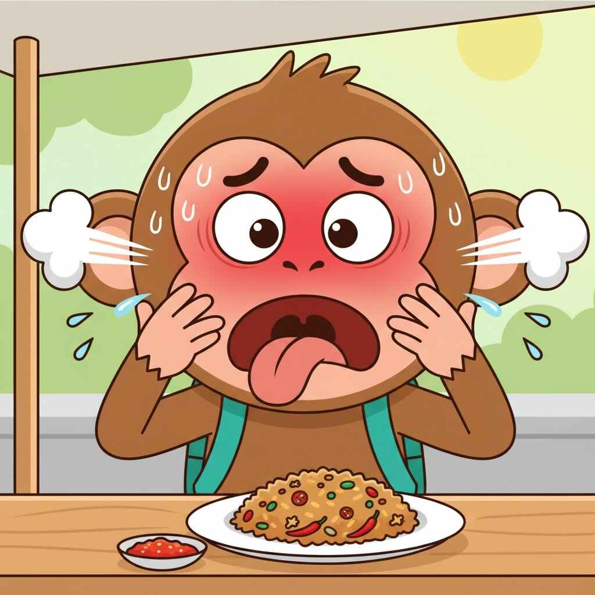

# Unit 03: Food & Dining (Warung Culture)

## 1. Learning Objectives
By the end of this unit, you will be able to:
*   Order food and drinks at a local *Warung* or restaurant.
*   Understand basic menus (*Goreng* vs. *Bakar*).
*   Ask for "Take away" vs. "Eat here".
*   Handle the "Spicy" (*Pedas*) situation.

## 2. Vocabulary

| Indonesian | English | Notes |
| :--- | :--- | :--- |
| **Makan** | To eat / Food | |
| **Minum** | To drink / Drink | |
| **Nasi** | Rice | The staple of life. |
| **Ayam** | Chicken | |
| **Ikan** | Fish | |
| **Goreng** | Fried | e.g., *Nasi Goreng* |
| **Bakar** | Grilled | e.g., *Ayam Bakar* |
| **Pedas** | Spicy | |
| **Manis** | Sweet | Important for tea! |
| **Air putih** | Water | Lit: "White water" |
| **Es** | Ice | |
| **Mau** | Want | Used to order. |
| **Suka** | Like | |
| **Enak** | Delicious | |
| **Bon / Bill** | The Bill | |

## 3. Grammar Focus

### A. Ordering: "Saya Mau..." vs. "Minta..."
To order food, you can use two simple structures:

1.  **Saya mau...** (I want...) - *Direct & Common.*
    *   *Saya mau Nasi Goreng.* (I want Fried Rice.)
2.  **Minta...** (Ask for/Request...) - *Polite Request.*
    *   *Minta air putih satu.* (Request one water.)

### B. Adjectives: The "Yang" Connector
Sometimes you need to be specific.
*   **Teh manis** = Sweet tea (Noun + Adjective).
*   **Teh tawar** = Plain tea (Unsweetened).

If you want to emphasize a preference, use **Yang**:
*   *Saya mau ayam yang **bakar**.* (I want the chicken that is **grilled**, not fried).
*   *Saya mau yang **tidak pedas**.* (I want the one that is **not spicy**).

### C. Negation: "Tidak" vs. "Jangan"
*   **Tidak** / **Enggak**: Simple "No".
    *   *Tidak pedas* = Not spicy.
*   **Jangan**: "Do not!" (Prohibition/Imperative).
    *   *Jangan pedas, ya!* = Don't make it spicy, okay! (Stronger instruction to the cook).

## 4. Dialogue: Lunch at a Warung

**Context:** Sarah enters a simple roadside eatery (*Warung*).

**Sarah:** Siang, Bu. Buka? (Open?)
**Ibu:** Siang, Mba. Buka, silakan duduk. Mau pesan apa?
**Sarah:** Saya mau **Nasi Goreng Ayam**, satu.
**Ibu:** Pedas nggak?
**Sarah:** **Jangan pedas**, ya Bu. Dikit saja. (Don't make it spicy. Just a little).
**Ibu:** Oke. Minumnya apa?
**Sarah:** **Es Teh Manis**, satu.
**Ibu:** Makan sini atau **bungkus**? (Eat here or wrap/take-away?)
**Sarah:** Makan sini saja.
**Ibu:** Tunggu sebentar ya.

### 🎧 Listen Online

Scan to hear native pronunciation:

  

<strong>https://indonesianbasics.com/audio#unit-03</strong>

### Audio Notes
1.  "Bungkus" is the magic word for Take-Away.
2.  "Pedas nggak?" is a quick way asking "Do you want it spicy?".

## 5. Cultural Note: Warung Etiquette & Hygiene

1.  **The Spoon & Fork:** You hold the **Spoon in your Right hand** (to eat) and the **Fork in your Left hand** (to push food onto the spoon). You rarely put the fork in your mouth.
2.  **The "Kobokan":** If you eat with your hands (common for Pecel Lele or Padang food), you will see a small bowl of water with a lime slice. **Do not drink it!** It is for washing your fingers before and after eating.
3.  **Right Hand Rule:** Always eat with your right hand. The left hand is traditionally considered "unclean" (toilet functions).

## 6. Exercises

### Exercise A: Menu Match
Match the dish to the description.

1.  Nasi Goreng ............ a. Grilled Chicken
2.  Ayam Bakar ............ b. Sweet Iced Tea
3.  Es Teh Manis ............ c. Fried Rice
4.  Air Putih ............ d. Plain Water

### Exercise B: Order Your Meal
Translate the following orders:

1.  I want one Fried Chicken.
    *   ................................................................
2.  Don't make it spicy!
    *   ................................................................
3.  Eat here.
    *   ................................................................
4.  Take away (Wrap it).
    *   ................................................................

### Exercise C: True or False
1.  You should drink the water in the small "Kobokan" bowl. ( T / F )
2.  "Jangan pedas" means "I want it very spicy." ( T / F )
3.  "Bungkus" means take-away. ( T / F )
