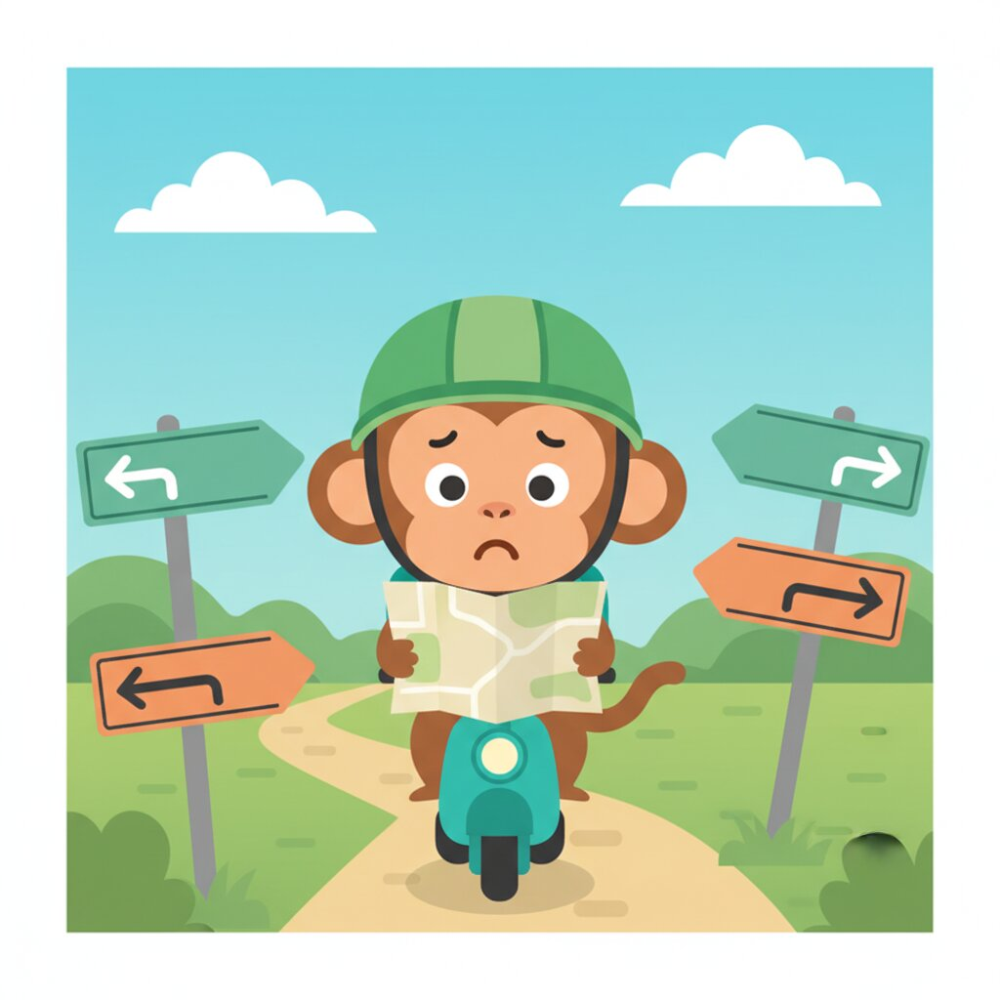

# Unit 04: Directions & Transportation (Kiri / Kanan)



## 1. Learning Objectives
By the end of this unit, you will be able to:
*   Give directions to a taxi or Gojek/Grab driver.
*   Understand basic locations (Left, Right, Straight).
*   Ask "Where is...?"
*   Navigate typical Indonesian landmarks.

## 2. Vocabulary

| Indonesian | English | Notes |
| :--- | :--- | :--- |
| **Di mana** | Where (is) | |
| **Ke mana** | Where (to) | |
| **Sini** | Here | Close to speaker. |
| **Situ / Sana** | There | Sana is farther away. |
| **Posisi?** | Where are you? | Casual - locals use this! |
| **Kiri** | Left | |
| **Kanan** | Right | |
| **Lurus** | Straight | |
| **Jalan** | Street / Walk / Go | *Jalan-jalan* = Walking around. |
| **Stop / Berhenti** | Stop | "Stop" is universally understood. |
| **Depan** | Front | |
| **Belakang** | Back / Behind | |
| **Dekat** | Near | |
| **Jauh** | Far | |
| **Belok** | Turn | |
| **Mobil** | Car | |
| **Motor** | Motorcycle | |

## 3. Grammar Focus

### A. Prepositions: Di, Ke, Dari
These are the big three for direction.
*   **Di** = At / In (Location). *Di hotel.*
*   **Ke** = To (Movement). *Ke pasar.*
*   **Dari** = From (Origin). *Dari bandara.*

### B. Asking "Where is...?"
Structure: **Di mana [Place]?**
*   *Di mana toilet?* (Where is the toilet?)
*   *Di mana Pantai Kuta?* (Where is Kuta Beach?)

### C. Giving Instructions (Imperatives)
To tell a driver what to do, just use the verb + direction.
*   **Belok kiri** = Turn left.
*   **Lurus terus** = Go straight continuously.
*   **Stop di sini** = Stop here.
*   **Stop di depan** = Stop at the front.

## 4. Dialogue: In a Taxi / Grab Car

**Context:** Budi is taking a Grab Car to his hotel. The driver confirms the location.

**Driver:** Siang, Pak. Sesuai aplikasi ya? *(Good day, Sir. According to the app, right?)*
**Budi:** Ya, Pak. Ke Hotel Santika. *(Yes, Sir. To Hotel Santika.)*
**Driver:** Lewat mana, Pak? *(Which way, Sir?)*
**Budi:** Ikut Google Maps saja, Pak. *(Just follow Google Maps, Sir.)*
*(Some time later)*
**Budi:** Pak, nanti belok kanan di depan ya. *(Sir, turn right ahead, okay.)*
**Driver:** Oke, siap. *(Okay, ready.)*
**Budi:** Masuk gang ini, lalu lurus terus. *(Enter this alley, then go straight.)*
**Driver:** Yang pagar hitam itu? *(The one with the black fence?)*
**Budi:** Ya, benar. Stop di kiri, Pak. *(Yes, correct. Stop on the left, Sir.)*
**Driver:** Oke. Sampai, Pak. *(Okay. We've arrived, Sir.)*

### 🎧 Listen Online

Scan to hear native pronunciation:

<p align="center">
  
</p>

<p align="center"><strong>https://indonesianbasics.com/audio#unit-04</strong></p>

### Audio Notes
1.  "Sesuai aplikasi" is the #1 phrase you will hear from Grab/Gojek drivers. It confirms you don't need to explain the destination if it's already set.
2.  "Gang" (pronounced 'Gung') is a small alleyway, very common in Bali and Java.

## 5. Cultural Note: Gojek & Grab (The Super Apps)
In Indonesia, you don't hail taxis on the street much anymore. You use apps like **Gojek** or **Grab**.
*   **GoBike/GrabBike:** Motorcycle taxi (Ojek). Fastest way to beat traffic (*Macet*). They provide a helmet.
*   **GoCar/GrabCar:** Private car.
*   **GoFood/GrabFood:** Food delivery (Life saver!).

**Safety Tip:** If you take a motorcycle taxi (Ojek), always wear the helmet (*Helm*) properly.

## 6. Exercises

<a id="ex-a"></a>
### A. Vocabulary Drill

**A1. Match the Indonesian to English:**

| | Indonesian | | English |
|---|---|---|---|
| 1. | Kiri | ___ | a. Far |
| 2. | Kanan | ___ | b. Straight |
| 3. | Lurus | ___ | c. Left |
| 4. | Dekat | ___ | d. Right |
| 5. | Jauh | ___ | e. Near |

**A2. Fill in the blank with the correct direction word:**
*(Depan, Belakang, Sini, Situ, Sana)*

1.  "Stop in front" → Stop di ____________
2.  "Behind the hotel" → Di ____________ hotel
3.  "Come here" → Ke ____________
4.  "Over there (far)" → Di ____________
5.  "There (medium distance)" → Di ____________

[See Answers A →](#ans-a)

---

<a id="ex-b"></a>
### B. Grammar Practice

**B1. Choose the correct preposition (Di / Ke / Dari):**

1.  I want to go ___ Bali. (movement to)
2.  I eat ___ the restaurant. (location at)
3.  I come ___ Australia. (origin from)
4.  The hotel is ___ here. (location at)
5.  I'm going ___ the beach. (movement to)

**B2. Give directions - Complete the instructions:**

1.  (Turn left) → ____________ kiri.
2.  (Go straight continuously) → Lurus ____________.
3.  (Stop here) → ____________ di sini.
4.  (Stop on the right) → Stop di ____________.
5.  (Turn right at the front) → Belok kanan di ____________.

**B3. Error Correction - Find and fix the mistake:**

1.  "Saya pergi di Bali." (Going to Bali)
    ▸ Correct: ________________________________________________
2.  "Toilet di mana ada?" (Where is the toilet?)
    ▸ Correct: ________________________________________________

[See Answers B →](#ans-b)

---

<a id="ex-c"></a>
### C. Translation Challenge

**C1. Translate to Indonesian:**

1.  Where is the beach?
    ▸ ________________________________________________________________
2.  Turn right at the front.
    ▸ ________________________________________________________________
3.  Is it far from here?
    ▸ ________________________________________________________________

**C2. Translate to English:**

1.  "Ikut Google Maps saja, Pak."
    ▸ ________________________________________________________________
2.  "Masuk gang ini, lalu lurus terus."
    ▸ ________________________________________________________________
3.  "Yang pagar hitam itu?"
    ▸ ________________________________________________________________

[See Answers C →](#ans-c)

---

<a id="ex-d"></a>
### D. Dialogue Comprehension

*Re-read the dialogue between Budi and the Grab driver, then answer:*

1.  What did the driver ask about the route?
    ▸ ________________________________________________________________
2.  What did Budi tell him to follow?
    ▸ ________________________________________________________________
3.  What direction did Budi say to turn?
    ▸ ________________________________________________________________
4.  What is a "gang" in Indonesian?
    ▸ ________________________________________________________________
5.  What color was the fence of Budi's destination?
    ▸ ________________________________________________________________

[See Answers D →](#ans-d)

---

<a id="ex-e"></a>
### E. Real-World Scenarios

**What would you say in these situations?**

1.  You're in a Grab car. The driver asks "Lewat mana?" What's a safe answer if you don't know the area?
    ▸ ________________________________________________________________
2.  You need to tell the driver to turn left at the next intersection.
    ▸ ________________________________________________________________
3.  You've arrived at your hotel. Tell the driver to stop on the left.
    ▸ ________________________________________________________________
4.  You're lost. Ask a stranger where the ATM is.
    ▸ ________________________________________________________________
5.  Someone asks you where you're from. Answer with your country.
    ▸ ________________________________________________________________

[See Answers E →](#ans-e)

---

<a id="ex-f"></a>
### F. Fun & Games

**F1. Word Search**
*Find these 10 words hidden in the grid:*
KIRI, KANAN, LURUS, DEPAN, BELAKANG, DEKAT, JAUH, MOBIL, MOTOR, JALAN

```
K I R I D E P A N X
A N A N M O B I L Y
N J A L A N U R U S
A B E L A K A N G Z
N D E K A T J A U H
M O T O R Q W E R T
```

**F2. Sentence Scramble - Rearrange the words:**

1.  [ kanan / Belok / depan / di ]
    ▸ ________________________________________________________________
2.  [ di / toilet / mana / ? / Di ]
    ▸ ________________________________________________________________
3.  [ terus / Lurus / saja ]
    ▸ ________________________________________________________________
4.  [ sini / Stop / di / Pak / , ]
    ▸ ________________________________________________________________

**F3. Vocabulary Puzzle**

*Write the Indonesian word for each clue:*

1. Front (5 letters)
   ▸ ________________________________________________________________
2. Here (4 letters)
   ▸ ________________________________________________________________
3. Street/Walk (5 letters)
   ▸ ________________________________________________________________
4. Straight (5 letters)
   ▸ ________________________________________________________________

[See Answers F →](#ans-f)

---

<a id="ex-g"></a>
### G. Cumulative Review (Units 01-03)

**Test your memory from previous units!**

1.  What title do you use for a young female server?
    ▸ ________________________________________________________________
2.  How do you say "75,000" in Indonesian?
    ▸ ________________________________________________________________
3.  Order one sweet iced tea using "Minta..."
    ▸ ________________________________________________________________
4.  What does "Bungkus" mean when ordering food?
    ▸ ________________________________________________________________

[See Answers G →](#ans-g)

---

### H. Self-Check: Am I Ready?

**Before moving to Unit 05, make sure you can:**

- [ ] Give basic directions (left, right, straight)
- [ ] Use Di, Ke, Dari correctly
- [ ] Ask "Where is...?"
- [ ] Tell a taxi/Grab driver where to stop
- [ ] Understand "Sesuai aplikasi" from drivers
- [ ] Know what a "Gang" is

---

### Answer Key - Unit 04

<a id="ans-a"></a>
**A1. Matching:** 1-c, 2-d, 3-b, 4-e, 5-a

**A2. Direction words:**
1. Depan, 2. Belakang, 3. Sini, 4. Sana, 5. Situ

[← Back to Exercise A](#ex-a)

---

<a id="ans-b"></a>
**B1. Prepositions:**
1. Ke, 2. Di, 3. Dari, 4. Di, 5. Ke

**B2. Directions:**
1. Belok, 2. terus, 3. Stop, 4. kanan, 5. depan

**B3. Error Correction:**
1. "Saya pergi ke Bali." (Use "ke" for movement to a place)
2. "Toilet di mana?" or "Di mana toilet?" (Standard question form)

[← Back to Exercise B](#ex-b)

---

<a id="ans-c"></a>
**C1. To Indonesian:**
1. Di mana pantai? / Pantai di mana?
2. Belok kanan di depan.
3. Jauh dari sini nggak? / Jauh nggak dari sini?

**C2. To English:**
1. Just follow Google Maps, Sir.
2. Enter this alley, then go straight.
3. The one with the black fence?

[← Back to Exercise C](#ex-c)

---

<a id="ans-d"></a>
**D. Dialogue Comprehension:**
1. "Lewat mana?" (Which way?)
2. Google Maps
3. Turn right (belok kanan)
4. A small alleyway
5. Black (hitam)

[← Back to Exercise D](#ex-d)

---

<a id="ans-e"></a>
**E. Scenarios (Sample answers):**
1. "Ikut Google Maps saja, Pak."
2. "Belok kiri di depan, ya Pak."
3. "Stop di kiri, Pak."
4. "Permisi, Pak/Bu. Di mana ATM?"
5. "Saya dari [country name]."

[← Back to Exercise E](#ex-e)

---

<a id="ans-f"></a>
**F1. Word Search:** All words found in grid

**F2. Sentence Scramble:**
1. Belok kanan di depan.
2. Di mana toilet? / Toilet di mana?
3. Lurus terus saja.
4. Stop di sini, Pak.

**F3. Vocabulary Puzzle:** 1. DEPAN, 2. SINI, 3. JALAN, 4. LURUS

[← Back to Exercise F](#ex-f)

---

<a id="ans-g"></a>
**G. Cumulative Review:**
1. Mba
2. Tujuh puluh lima ribu
3. Minta Es Teh Manis satu.
4. Take away / Wrap it up

[← Back to Exercise G](#ex-g)
