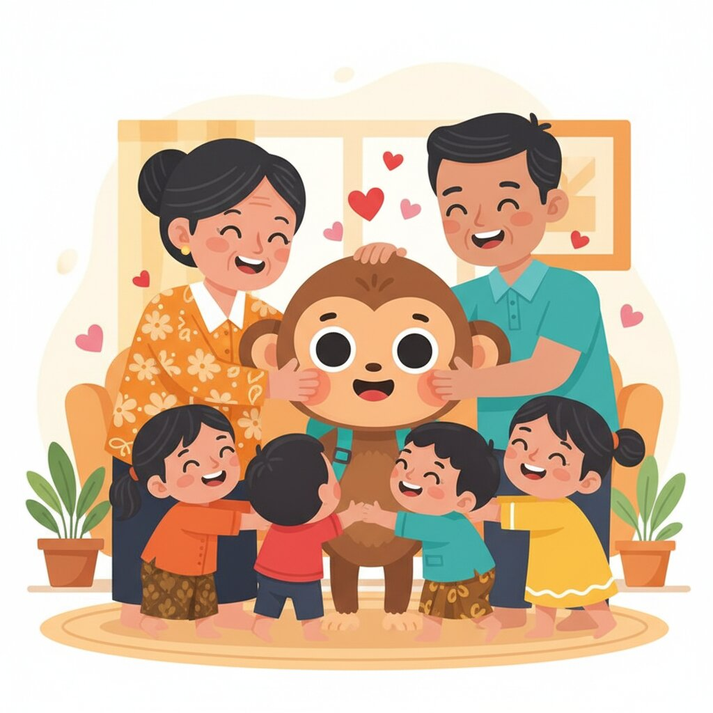

# Unit 06: Family & Possession (Punya)

## 1. Learning Objectives
By the end of this unit, you will be able to:
*   Talk about your family.
*   Use the verb "Punya" (To Have).
*   Use possessive suffixes (-ku, -mu, -nya).
*   Ask "Do you have...?"

## 2. Vocabulary

| Indonesian | English | Notes |
| :--- | :--- | :--- |
| **Keluarga** | Family | |
| **Orang tua** | Parents | Lit: "Old People" |
| **Ayah / Bapak** | Father | |
| **Ibu / Mama** | Mother | |
| **Anak** | Child | |
| **Kakak** | Older Sibling | Gender neutral. |
| **Adik** | Younger Sibling | Gender neutral. |
| **Suami** | Husband | |
| **Istri** | Wife | |
| **Teman** | Friend | |
| **Pacar** | Boyfriend/Girlfriend | |
| **Punya** | Have / Own | |
| **Ada** | There is / exist | Often confused with Punya. |
| **Menikah** | Married | |

## 3. Grammar Focus

### A. To Have: "Punya"
Structure: **Subject + Punya + Object**
*   *Saya punya anjing.* (I have a dog.)
*   *Budi punya mobil baru.* (Budi has a new car.)

**Negation:**
*   *Saya **tidak punya** uang.* (I don't have money).

### B. Possessive Suffixes (-ku, -mu, -nya)
Instead of "My book", Indonesian often attaches the pronoun to the noun.

1.  **Saya** -> **-ku** (My)
    *   *Rumahku* = My house.
2.  **Kamu** -> **-mu** (Your - informal)
    *   *Namamu* = Your name.
3.  **Dia** -> **-nya** (His/Her/Its)
    *   *Rumahnya* = His/Her house.

**Formal Possession:**
For formal situations (using titles), place the title after the noun.
*   *Nama Anda* -> *Nama Bapak* / *Nama Ibu*.
*   *Rumah Pak Budi* (Mr. Budi's house).

## 4. Dialogue: Showing Photos

**Context:** Sarah shows a photo on her phone to Ibu Wayan.

**Ibu Wayan:** Ini siapa, Mba Sarah?
**Sarah:** Ini **adikku**, namanya Tom.
**Ibu Wayan:** Ganteng ya (Handsome). Dia **punya** pacar?
**Sarah:** Sudah. Ini pacarnya, Lisa.
**Ibu Wayan:** Wah, cantik. Kalau ini?
**Sarah:** Ini **orang tua** saya. Ayah dan Ibu.
**Ibu Wayan:** Mba Sarah punya kakak?
**Sarah:** Tidak punya. Saya anak tunggal (only child).

### 🎧 Listen Online

Scan to hear native pronunciation:

  

<strong>https://indonesianbasics.com/audio#unit-06</strong>

### Audio Notes
1.  Notice the mix of "-ku" (casual/intimate) and "Saya" (neutral).
2.  "Ganteng" is for men, "Cantik" is for women.

## 5. Cultural Note: Family Status
In Indonesia, family is everything. People will often ask you very personal questions early on:
*   *"Sudah nikah?"* (Are you married?)
*   *"Punya anak?"* (Do you have kids?)

Don't be offended! They are trying to "place" you in the social structure.
*   **If Single:** Use *"Belum"* (Not yet) instead of "No". It's more polite/optimistic.

## 6. Exercises

### Exercise A: Possessives
Convert to Indonesian using suffixes (-ku, -mu, -nya).
1.  My name = ....................
2.  Your (informal) friend = ....................
3.  Her husband = ....................

### Exercise B: Translate "Punya"
1.  I have two children.
    *   ................................................................
2.  She has a big house.
    *   ................................................................
3.  Do you have money?
    *   ................................................................

### Exercise C: Family Tree
1.  Your father's wife is your ....................
2.  Your younger brother is your ....................
3.  Your "Orang tua" are your ....................
