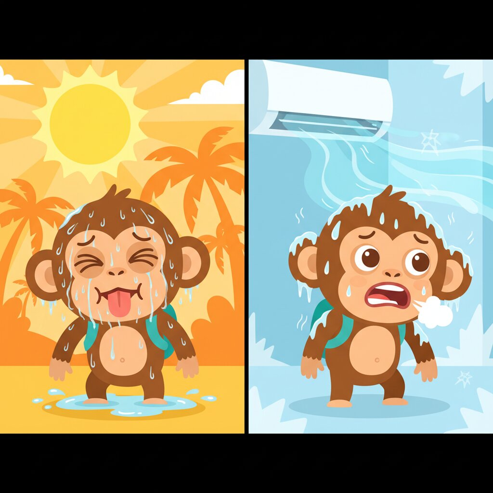

# Unit 07: Adjectives (Hot/Cold/Spicy)



## 1. Learning Objectives
By the end of this unit, you will be able to:
*   Describe things (Food, Weather, Places).
*   Use "Yang" to link Nouns and Adjectives.
*   Make comparisons (More than / The most).
*   Express feelings (Happy, Tired, Hot).

## 2. Vocabulary

| Indonesian | English | Notes |
| :--- | :--- | :--- |
| **Bagus** | Good / Nice | For quality & condition of things. |
| **Baik** | Good / Kind | For morality & manner of people. |
| **Besar** | Big | |
| **Kecil** | Small | |
| **Panas** | Hot | Weather/Temp. |
| **Dingin** | Cold | |
| **Jauh** | Far | |
| **Dekat** | Near | |
| **Capek** | Tired | Pronounced "Cha-pek". |
| **Senang** | Happy | |
| **Sakit** | Sick / Pain | |
| **Enak** | Delicious / Comfy | Used for food OR feeling good. |
| **Baru** | New | |
| **Lama** | Old (Things) / Long time | |
| **Tua** | Old (People) | |
| **Sangat / Banget** | Very | *Banget* is casual (goes after adj). |

## 3. Grammar Focus

### A. Word Order: Noun + Adjective
In English: "Big House" (Adj + Noun).
In Indonesian: **"Rumah Besar"** (Noun + Adj). Always flip it!

*   *Nasi goreng pedas* = Spicy fried rice.
*   *Mobil merah* = Red car.

### B. "Yang" (The One That Is...)
**Yang** is a bridge word. It adds emphasis or distinction.
*   *Saya mau teh.* (I want tea - general).
*   *Saya mau teh **yang** manis.* (I want the tea **that is** sweet).

### C. Intensifiers: "Sangat" vs "Banget"
*   **Sangat:** Formal, goes *BEFORE* adjective.
    ▸ *Sangat ganteng.* (Very handsome.)
    ▸ *Bali sangat indah.* (Bali is very beautiful.)
*   **Banget:** Casual, goes *AFTER* adjective.
    ▸ *Ganteng banget!* (So handsome!)
    ▸ *Bali indah banget!* (Bali is so beautiful!)

## 4. Dialogue: Complaining about the Weather

**Context:** Budi and Sarah are walking outside in Jakarta.

**Sarah:** Aduh, hari ini panas banget ya! *(Ugh, it's so hot today!)*
**Budi:** Iya, gila. Matahari kuat sekali. *(Yeah, crazy. The sun is so strong.)*
**Sarah:** Kita cari tempat yang dingin yuk. Masuk mall? *(Let's find a cold place. Go into a mall?)*
**Budi:** Boleh. Mall Grand Indonesia dekat dari sini. *(Sure. Grand Indonesia Mall is close from here.)*
**Sarah:** Jauh nggak kalau jalan kaki? *(Is it far if we walk?)*
**Budi:** Lumayan. Tapi capek. Naik Gojek saja? *(So-so. But tiring. Just take Gojek?)*
**Sarah:** Ide bagus. *(Good idea.)*

### 🎧 Listen Online

Scan to hear native pronunciation:

<p align="center">
  
</p>

<p align="center"><strong>https://indonesianbasics.com/audio#unit-07</strong></p>

### Audio Notes
1.  "Yuk" is a casual "Let's". *Makan yuk* (Let's eat).
2.  "Lumayan" is a very useful word for "Not bad / So-so / Average".

## 5. Cultural Note: "Masuk Angin"
Indonesians believe many illnesses are caused by "Trapped Wind" (**Masuk Angin**).
Symptoms: Bloating, fever, flu, feeling unwell.
Cause: Rain, late nights, fans, air conditioning.
Cure: **Kerokan** (Coin scraping on back) or drinking *Tolak Angin* (a popular "magic" herbal remedy).

## 6. Exercises

<a id="ex-a"></a>
### A. Vocabulary Drill

**A1. Match the Indonesian to English:**

| | Indonesian | | English |
|---|---|---|---|
| 1. | Panas | ___ | a. Near |
| 2. | Dingin | ___ | b. Tired |
| 3. | Capek | ___ | c. Cold |
| 4. | Senang | ___ | d. Hot |
| 5. | Dekat | ___ | e. Happy |

**A2. Fill in the blank with the correct adjective:**
*(Bagus, Baik, Besar, Kecil, Enak)*

1.  The food is delicious: Makanan ini ____________
2.  He is a good/kind person: Dia orang ____________
3.  Nice house!: Rumah ____________!
4.  A big city: Kota ____________
5.  A small room: Kamar ____________

[See Answers A →](#ans-a)

---

<a id="ex-b"></a>
### B. Grammar Practice

**B1. Flip the phrase (Remember: Noun + Adjective):**

1.  Cold water = ____________
2.  Big city = ____________
3.  Spicy chicken = ____________
4.  New car = ____________
5.  Hot weather = ____________

**B2. Find the opposite:**

1.  Panas (hot) → ____________
2.  Besar (big) → ____________
3.  Jauh (far) → ____________
4.  Baru (new) → ____________
5.  Tua (old - people) → ____________ (young)

**B3. Use the correct intensifier (Sangat / Banget):**

1.  (Formal) Bali is very beautiful: Bali ____________ indah.
2.  (Casual) Today is so hot!: Hari ini panas ____________!
3.  (Formal) The food is very delicious: Makanan ini ____________ enak.
4.  (Casual) I'm so tired!: Saya capek ____________!

[See Answers B →](#ans-b)

---

<a id="ex-c"></a>
### C. Translation Challenge

**C1. Translate to Indonesian:**

1.  It's very hot today!
    ▸ ________________________________________________________________
2.  Let's find a cold place.
    ▸ ________________________________________________________________
3.  This idea is good.
    ▸ ________________________________________________________________

**C2. Translate to English:**

1.  "Saya mau teh yang manis."
    ▸ ________________________________________________________________
2.  "Mall Grand Indonesia dekat dari sini."
    ▸ ________________________________________________________________
3.  "Lumayan capek."
    ▸ ________________________________________________________________

[See Answers C →](#ans-c)

---

<a id="ex-d"></a>
### D. Dialogue Comprehension

*Re-read the dialogue between Budi and Sarah about the weather, then answer:*

1.  What was the weather like that day?
    ▸ ________________________________________________________________
2.  What did Sarah suggest they do?
    ▸ ________________________________________________________________
3.  How far was Grand Indonesia from where they were?
    ▸ ________________________________________________________________
4.  Why did Budi suggest taking Gojek instead of walking?
    ▸ ________________________________________________________________
5.  What does "Yuk" mean in casual Indonesian?
    ▸ ________________________________________________________________

[See Answers D →](#ans-d)

---

<a id="ex-e"></a>
### E. Real-World Scenarios

**What would you say in these situations?**

1.  You just ate really delicious food. Compliment it casually.
    ▸ ________________________________________________________________
2.  You're exhausted after a long walk. Express that casually.
    ▸ ________________________________________________________________
3.  It's very cold in the air-conditioned room. Describe it.
    ▸ ________________________________________________________________
4.  Someone asks if the beach is far. It's quite close. What do you say?
    ▸ ________________________________________________________________
5.  You want tea that is sweet, not plain. Use "Yang" to specify.
    ▸ ________________________________________________________________

[See Answers E →](#ans-e)

---

<a id="ex-f"></a>
### F. Fun & Games

**F1. Word Search**
*Find these 10 words hidden in the grid:*
PANAS, DINGIN, BAGUS, BESAR, KECIL, CAPEK, SENANG, ENAK, BARU, LAMA

```
P A N A S B A G U S
D I N G I N E N A K
B E S A R K E C I L
C A P E K L A M A X
S E N A N G B A R U
```

**F2. Sentence Scramble - Rearrange the words:**

1.  [ banget / panas / ini / Hari ]
    ▸ ________________________________________________________________
2.  [ dingin / yang / tempat / cari / Kita ]
    ▸ ________________________________________________________________
3.  [ bagus / Ide ]
    ▸ ________________________________________________________________
4.  [ sini / dari / Mall / dekat ]
    ▸ ________________________________________________________________

**F3. Vocabulary Puzzle**

*Write the Indonesian word for each clue:*

1. Hot (5 letters)
   ▸ ________________________________________________________________
2. Cold (6 letters)
   ▸ ________________________________________________________________
3. Good/Nice - for things (5 letters)
   ▸ ________________________________________________________________
4. Tired (5 letters)
   ▸ ________________________________________________________________

[See Answers F →](#ans-f)

---

<a id="ex-g"></a>
### G. Cumulative Review (Units 01-06)

**Test your memory from previous units!**

1.  What title do you use for an older male?
    ▸ ________________________________________________________________
2.  How do you say "Can you lower the price?"
    ▸ ________________________________________________________________
3.  Order fried rice with no spice.
    ▸ ________________________________________________________________
4.  Tell the driver to stop in front.
    ▸ ________________________________________________________________
5.  Say "I have two children."
    ▸ ________________________________________________________________

[See Answers G →](#ans-g)

---

### H. Self-Check: Am I Ready?

**Before moving to Unit 08, make sure you can:**

- [ ] Use common adjectives (hot, cold, big, small, etc.)
- [ ] Remember: Noun + Adjective order in Indonesian
- [ ] Use "Yang" to specify characteristics
- [ ] Use "Sangat" (formal) and "Banget" (casual) for emphasis
- [ ] Know adjective opposites
- [ ] Understand "Masuk Angin" culture

---

### Answer Key - Unit 07

<a id="ans-a"></a>
**A1. Matching:** 1-d, 2-c, 3-b, 4-e, 5-a

**A2. Adjectives:**
1. Enak, 2. Baik, 3. Bagus, 4. Besar, 5. Kecil

[← Back to Exercise A](#ex-a)

---

<a id="ans-b"></a>
**B1. Flip the phrase:**
1. Air dingin, 2. Kota besar, 3. Ayam pedas, 4. Mobil baru, 5. Cuaca panas

**B2. Opposites:**
1. Dingin, 2. Kecil, 3. Dekat, 4. Lama, 5. Muda

**B3. Intensifiers:**
1. Sangat (formal, before adjective), 2. Banget (casual, after adjective)
3. Sangat (formal), 4. Banget (casual)

[← Back to Exercise B](#ex-b)

---

<a id="ans-c"></a>
**C1. To Indonesian:**
1. Hari ini panas banget!
2. Kita cari tempat yang dingin, yuk.
3. Ide ini bagus. / Ide bagus.

**C2. To English:**
1. I want the tea that is sweet.
2. Grand Indonesia Mall is near from here.
3. Pretty tired. / So-so tired.

[← Back to Exercise C](#ex-c)

---

<a id="ans-d"></a>
**D. Dialogue Comprehension:**
1. Very hot (panas banget)
2. Go inside a mall to find a cold/cool place
3. Not too far, but tiring to walk (lumayan)
4. Because they were tired (capek)
5. "Let's" - casual invitation

[← Back to Exercise D](#ex-d)

---

<a id="ans-e"></a>
**E. Scenarios (Sample answers):**
1. "Enak banget!"
2. "Capek banget!"
3. "Dingin banget di sini!" / "AC-nya dingin banget!"
4. "Dekat kok, tidak jauh."
5. "Saya mau teh yang manis."

[← Back to Exercise E](#ex-e)

---

<a id="ans-f"></a>
**F1. Word Search:** All words found in grid

**F2. Sentence Scramble:**
1. Hari ini panas banget.
2. Kita cari tempat yang dingin.
3. Ide bagus.
4. Mall dekat dari sini.

**F3. Vocabulary Puzzle:** 1. PANAS, 2. DINGIN, 3. BAGUS, 4. CAPEK

[← Back to Exercise F](#ex-f)

---

<a id="ans-g"></a>
**G. Cumulative Review:**
1. Pak
2. Boleh kurang, nggak?
3. Saya mau Nasi Goreng. Jangan pedas, ya.
4. Stop di depan, Pak.
5. Saya punya dua anak.

[← Back to Exercise G](#ex-g)
