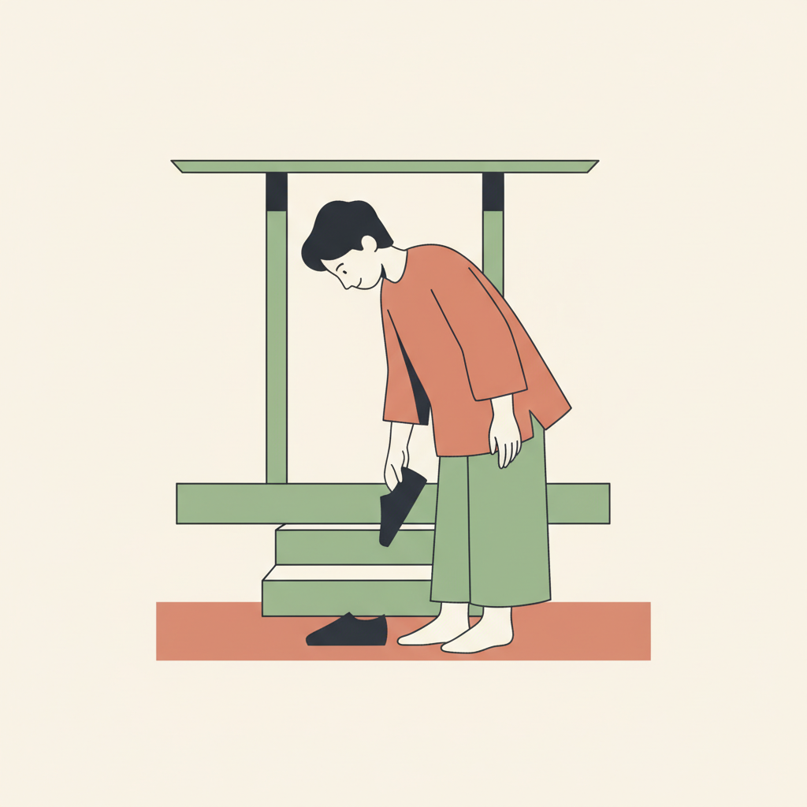

# Unit 10: Social Etiquette & Polite Requests

## 1. Learning Objectives
By the end of this unit, you will be able to:
*   Be super polite in Indonesian.
*   Apologize correctly (*Maaf* vs *Permisi*).
*   Use "Silakan" (Please go ahead).
*   Understand basic social taboos.

## 2. Vocabulary

| Indonesian | English | Notes |
| :--- | :--- | :--- |
| **Maaf** | Sorry | For mistakes. |
| **Permisi** | Excuse me | For passing by / getting attention. |
| **Silakan** | Please (go ahead) | Offering something. |
| **Tolong** | Please (help) | Asking for something. |
| **Boleh** | May I? | Asking permission. |
| **Terima kasih** | Thank you | |
| **Sama-sama** | You're welcome | |
| **Kembali** | You're welcome | Short for "Terima kasih kembali". |
| **Tidak apa-apa** | It's okay / No problem | Common response to "Maaf". |
| **Hati-hati** | Be careful / Safe trip | |
| **Santai** | Relax / Chill | |

## 3. Grammar Focus

### A. The Three "Pleases"
English has "Please". Indonesian has three, depending on context:

1.  **Tolong:** When **asking** for help/items.
    *   *Tolong ambilkan air.* (Please get water).
2.  **Silakan:** When **offering** something.
    *   *Silakan duduk.* (Please sit down).
    *   *Silakan masuk.* (Please come in).
3.  **Mohon:** Very formal request (Official announcements).
    *   *Mohon antri.* (Please queue).

### B. "Maaf" vs "Permisi"
*   **Maaf:** Use when you made a mistake, bumped into someone, or are late.
*   **Permisi:** Use when passing in front of someone, entering a room, or asking a stranger a question.
    *   *Permisi, Pak. Toilet di mana?*

## 4. Dialogue: Visiting a Balinese Home

**Context:** Sarah is invited to Ibu Wayan's house.

**Sarah:** (Knocking) **Permisi**... Selamat sore.
**Ibu Wayan:** Eh, Mba Sarah. **Silakan masuk**.
**Sarah:** Terima kasih, Bu. **Maaf** saya terlambat sedikit. Macet.
**Ibu Wayan:** **Tidak apa-apa**, santai saja. **Silakan duduk**.
**Sarah:** Wah, rumahnya bagus sekali.
**Ibu Wayan:** Biasa saja (Just ordinary/humble). **Silakan diminum** tehnya.
**Sarah:** Terima kasih, Bu.

### 🎧 Listen Online

Scan to hear native pronunciation:

  

<strong>https://indonesianbasics.com/audio#unit-10</strong>

### Audio Notes
1.  Note the repeated use of "Silakan" by the host.
2.  "Biasa saja" is a humble response to a compliment. Indonesians rarely agree with compliments directly (that would be arrogant).

## 5. Cultural Note: Taboos & Body Language
1.  **Touching Heads:** The head is sacred. Never pat an adult or child on the head.
2.  **Pointing:** Don't point with your index finger. It's rude. Use your **thumb** (right hand) or an open hand.
3.  **Feet:** Feet are dirty. Do not put feet on tables. Remove shoes before entering a home.
4.  **Hands on Hips:** Standing with hands on hips (Akimbo) signifies anger or defiance (like a Wayang character ready to fight). Avoid it when talking to police or elders!

## 6. Exercises

### Exercise A: Which "Please"?
(Silakan / Tolong)
1.  .................... drink this tea. (Offering)
2.  .................... help me. (Asking)
3.  .................... come inside. (Offering)
4.  .................... close the door. (Asking)

### Exercise B: Social Situations
What do you say?
1.  You want to ask a stranger for directions.
    *   ................................................................
2.  You stepped on someone's foot.
    *   ................................................................
3.  You invite someone to sit.
    *   ................................................................

## CONGRATULATIONS!
You have finished the **Survival Indonesian** Course (A1).
**Selamat! Anda hebat!**
