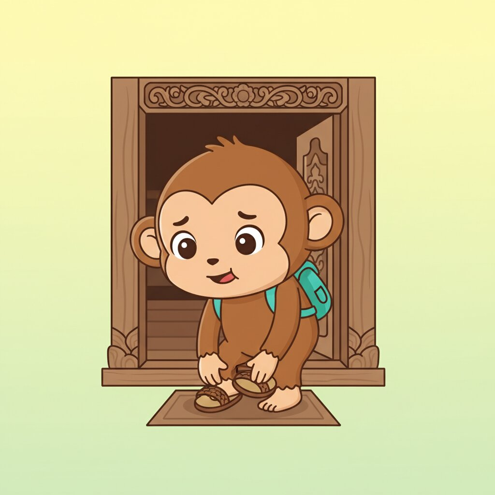

# Unit 10: Social Etiquette & Polite Requests



## 1. Learning Objectives
By the end of this unit, you will be able to:
*   Be super polite in Indonesian.
*   Apologize correctly (*Maaf* vs *Permisi*).
*   Use "Silakan" (Please go ahead).
*   Understand basic social taboos.

## 2. Vocabulary

| Indonesian | English | Notes |
| :--- | :--- | :--- |
| **Maaf** | Sorry | For mistakes. |
| **Permisi** | Excuse me | For passing by / getting attention. |
| **Silakan** | Please (go ahead) | Offering something. |
| **Tolong** | Please (help) | Asking for something. |
| **Boleh** | May I? / Allowed | E.g., "Boleh saya makan?" → "Ya, boleh." |
| **Terima kasih** | Thank you | |
| **Sama-sama** | You're welcome | |
| **Kembali** | You're welcome | Short for "Terima kasih kembali". |
| **Tidak apa-apa** | It's okay / No problem | Common response to "Maaf". |
| **Hati-hati** | Be careful / Safe trip | |
| **Santai** | Relax / Chill | |

## 3. Grammar Focus

### A. The Three "Pleases"
English has "Please". Indonesian has three, depending on context:

1.  **Tolong:** When **asking** for help/items.
    ▸ *Tolong ambilkan air.* (Please get water).
2.  **Silakan:** When **offering** something.
    ▸ *Silakan duduk.* (Please sit down).
    ▸ *Silakan masuk.* (Please come in).
3.  **Mohon:** Very formal request (Official announcements).
    ▸ *Mohon antri.* (Please queue).

### B. "Maaf" vs "Permisi"
*   **Maaf:** Use when you made a mistake, bumped into someone, or are late.
*   **Permisi:** Use when passing in front of someone, entering a room, or asking a stranger a question.
    ▸ *Permisi, Pak. Toilet di mana?*

## 4. Dialogue: Visiting a Balinese Home

**Context:** Sarah is invited to Ibu Wayan's house.

**Sarah:** (Knocking) Permisi... Selamat sore. *(Excuse me... Good afternoon.)*
**Ibu Wayan:** Eh, Mba Sarah. Silakan masuk. *(Oh, Miss Sarah. Please come in.)*
**Sarah:** Terima kasih, Bu. Maaf saya terlambat sedikit. Macet. *(Thank you, Ma'am. Sorry I'm a bit late. Traffic.)*
**Ibu Wayan:** Tidak apa-apa, santai saja. Silakan duduk. *(No problem, just relax. Please sit down.)*
**Sarah:** Wah, rumahnya bagus sekali. *(Wow, your house is so nice.)*
**Ibu Wayan:** Biasa saja. Silakan diminum tehnya. *(Just ordinary. Please drink the tea.)*
**Sarah:** Terima kasih, Bu. *(Thank you, Ma'am.)*

### 🎧 Listen Online

Scan to hear native pronunciation:

<p align="center">
  
</p>

<p align="center"><strong>https://indonesianbasics.com/audio#unit-10</strong></p>

### Audio Notes
1.  Note the repeated use of "Silakan" by the host.
2.  "Biasa saja" is a humble response to a compliment. Indonesians rarely agree with compliments directly (that would be arrogant).

## 5. Cultural Note: Taboos & Body Language
1.  **Touching Heads:** The head is sacred. Never pat an adult or child on the head.
2.  **Pointing:** Don't point with your index finger. It's rude. Use your **thumb** (right hand) or an open hand.
3.  **Feet:** Feet are dirty. Do not put feet on tables. Remove shoes before entering a home.
4.  **Hands on Hips:** Standing with hands on hips (Akimbo) signifies anger or defiance (like a Wayang character ready to fight). Avoid it when talking to police or elders!

## 6. Exercises

<a id="ex-a"></a>
### A. Vocabulary Drill

**A1. Match the Indonesian to English:**

| | Indonesian | | English |
|---|---|---|---|
| 1. | Maaf | ___ | a. You're welcome |
| 2. | Permisi | ___ | b. Be careful |
| 3. | Silakan | ___ | c. Sorry (apology) |
| 4. | Sama-sama | ___ | d. Please go ahead |
| 5. | Hati-hati | ___ | e. Excuse me |

**A2. Fill in the blank with the correct polite word:**
*(Maaf, Permisi, Tolong, Silakan, Terima kasih)*

1.  Passing by someone: ____________, Pak.
2.  You made a mistake: ____________!
3.  Asking for help: ____________ bantu saya.
4.  Offering a seat: ____________ duduk.
5.  After receiving something: ____________.

[See Answers A →](#ans-a)

---

<a id="ex-b"></a>
### B. Grammar Practice

**B1. Choose the correct "Please" (Tolong / Silakan / Mohon):**

1.  (Offering tea to guest) → ____________ diminum.
2.  (Asking someone to help) → ____________ bantu saya.
3.  (Please sit down - offering) → ____________ duduk.
4.  (Please close the door - asking) → ____________ tutup pintu.
5.  (Formal: Please wait - official sign) → ____________ tunggu.

**B2. Choose "Maaf" or "Permisi":**

1.  You accidentally step on someone's foot: ____________!
2.  You want to pass through a crowd: ____________, permisi.
3.  You are late to a meeting: ____________, saya terlambat.
4.  You want to get a stranger's attention: ____________, Pak.
5.  You spilled your drink on someone: ____________ banget!

**B3. How would you respond politely?**

1.  Someone says "Terima kasih." You reply: ____________
2.  Someone says "Maaf." You reply: ____________
3.  Someone compliments your house. You reply humbly: ____________

[See Answers B →](#ans-b)

---

<a id="ex-c"></a>
### C. Translation Challenge

**C1. Translate to Indonesian:**

1.  Excuse me, where is the toilet?
    ▸ ________________________________________________________________
2.  Sorry I'm late.
    ▸ ________________________________________________________________
3.  Please come in.
    ▸ ________________________________________________________________

**C2. Translate to English:**

1.  "Silakan diminum tehnya."
    ▸ ________________________________________________________________
2.  "Tidak apa-apa, santai saja."
    ▸ ________________________________________________________________
3.  "Biasa saja."
    ▸ ________________________________________________________________

[See Answers C →](#ans-c)

---

<a id="ex-d"></a>
### D. Dialogue Comprehension

*Re-read the dialogue where Sarah visits Ibu Wayan's house, then answer:*

1.  What did Sarah say when she knocked on the door?
    ▸ ________________________________________________________________
2.  Why did Sarah apologize?
    ▸ ________________________________________________________________
3.  What did Ibu Wayan offer Sarah?
    ▸ ________________________________________________________________
4.  What does "Biasa saja" mean and why did Ibu Wayan say it?
    ▸ ________________________________________________________________
5.  How many times did Ibu Wayan use "Silakan"?
    ▸ ________________________________________________________________

[See Answers D →](#ans-d)

---

<a id="ex-e"></a>
### E. Real-World Scenarios

**What would you say in these situations?**

1.  You need to pass through a group of people at a market.
    ▸ ________________________________________________________________
2.  You accidentally bump into someone.
    ▸ ________________________________________________________________
3.  You're hosting a guest and want to offer them a drink.
    ▸ ________________________________________________________________
4.  Someone thanks you for your help.
    ▸ ________________________________________________________________
5.  You're pointing at something. Should you use your index finger? Why or why not?
    ▸ ________________________________________________________________

[See Answers E →](#ans-e)

---

<a id="ex-f"></a>
### F. Fun & Games

**F1. Word Search**
*Find these 10 words hidden in the grid:*
MAAF, PERMISI, SILAKAN, TOLONG, BOLEH, TERIMA, KASIH, SANTAI, KEMBALI, HATI

```
M A A F P E R M I S I
S I L A K A N T O L O N G
B O L E H K E M B A L I
T E R I M A K A S I H
S A N T A I H A T I X
```

**F2. Sentence Scramble - Rearrange the words:**

1.  [ diminum / Silakan / tehnya ]
    ▸ ________________________________________________________________
2.  [ Pak / Permisi / toilet / di mana / ? ]
    ▸ ________________________________________________________________
3.  [ terlambat / Maaf / sedikit / saya ]
    ▸ ________________________________________________________________
4.  [ duduk / Silakan ]
    ▸ ________________________________________________________________

**F3. Social Etiquette Quiz - True or False:**

1.  You should point with your index finger in Indonesia. ( T / F )
2.  You can pat children on the head as a friendly gesture. ( T / F )
3.  Standing with hands on hips shows confidence. ( T / F )
4.  You should remove shoes before entering a home. ( T / F )
5.  Answering "Belum" to "Sudah nikah?" is more polite than "Tidak." ( T / F )

[See Answers F →](#ans-f)

---

<a id="ex-g"></a>
### G. Final Cumulative Review (Units 01-09)

**Comprehensive test of all your Indonesian knowledge!**

1.  What title do you use for a young male?
    ▸ ________________________________________________________________
2.  How do you say "200,000" in Indonesian?
    ▸ ________________________________________________________________
3.  Order fried rice with chicken, not spicy.
    ▸ ________________________________________________________________
4.  Tell a driver to turn right ahead.
    ▸ ________________________________________________________________
5.  Ask "What time does the shop open?"
    ▸ ________________________________________________________________
6.  Say "I have two older siblings."
    ▸ ________________________________________________________________
7.  Describe the weather: "It's very cold today!"
    ▸ ________________________________________________________________
8.  Say "I have a stomach ache."
    ▸ ________________________________________________________________
9.  Ask someone: "Have you ever been to Bali?"
    ▸ ________________________________________________________________
10. Respond politely when offered something: "____________"
    ▸ ________________________________________________________________

[See Answers G →](#ans-g)

---

### H. Self-Check: Course Complete!

**You've completed the Survival Indonesian Course! Make sure you can:**

- [ ] Use proper titles (Mas, Mba, Pak, Bu)
- [ ] Handle numbers and bargaining
- [ ] Order food and drinks
- [ ] Give and understand directions
- [ ] Tell time and days
- [ ] Talk about family and possessions
- [ ] Use common adjectives
- [ ] Express health concerns
- [ ] Use past/present/future markers
- [ ] Be polite in social situations

---

### Answer Key - Unit 10

<a id="ans-a"></a>
**A1. Matching:** 1-c, 2-e, 3-d, 4-a, 5-b

**A2. Polite words:**
1. Permisi, 2. Maaf, 3. Tolong, 4. Silakan, 5. Terima kasih

[← Back to Exercise A](#ex-a)

---

<a id="ans-b"></a>
**B1. Please (correct form):**
1. Silakan (offering), 2. Tolong (asking), 3. Silakan (offering), 4. Tolong (asking), 5. Mohon (formal)

**B2. Maaf/Permisi:**
1. Maaf, 2. Permisi, 3. Maaf, 4. Permisi, 5. Maaf

**B3. Responses:**
1. Sama-sama / Kembali
2. Tidak apa-apa
3. Biasa saja (Just ordinary - humble response)

[← Back to Exercise B](#ex-b)

---

<a id="ans-c"></a>
**C1. To Indonesian:**
1. Permisi, di mana toilet?
2. Maaf saya terlambat.
3. Silakan masuk.

**C2. To English:**
1. Please drink the tea.
2. It's okay, just relax.
3. Just ordinary / Nothing special (humble response)

[← Back to Exercise C](#ex-c)

---

<a id="ans-d"></a>
**D. Dialogue Comprehension:**
1. "Permisi... Selamat sore."
2. She was a little late because of traffic (macet)
3. Tea (teh)
4. "Just ordinary" - a humble response to a compliment (Indonesian culture)
5. Three times (masuk, duduk, diminum)

[← Back to Exercise D](#ex-d)

---

<a id="ans-e"></a>
**E. Scenarios (Sample answers):**
1. "Permisi, permisi..."
2. "Maaf!"
3. "Silakan diminum."
4. "Sama-sama."
5. No - use your thumb or open hand. Pointing with index finger is rude.

[← Back to Exercise E](#ex-e)

---

<a id="ans-f"></a>
**F1. Word Search:** All words found in grid

**F2. Sentence Scramble:**
1. Silakan diminum tehnya.
2. Permisi, Pak. Toilet di mana?
3. Maaf saya terlambat sedikit.
4. Silakan duduk.

**F3. True/False:**
1. F (use thumb), 2. F (head is sacred), 3. F (shows anger), 4. T, 5. T

[← Back to Exercise F](#ex-f)

---

<a id="ans-g"></a>
**G. Final Review:**
1. Mas
2. Dua ratus ribu
3. Saya mau Nasi Goreng Ayam. Jangan pedas, ya.
4. Belok kanan di depan, Pak.
5. Jam berapa toko buka?
6. Saya punya dua kakak.
7. Hari ini dingin banget!
8. Saya sakit perut.
9. Pernah ke Bali?
10. Terima kasih.

[← Back to Exercise G](#ex-g)

---

## CONGRATULATIONS!

You have finished the **Survival Indonesian** Course (A1-A2).

**Selamat! Kamu hebat banget!**

You now have the foundation to:
- Navigate daily life in Indonesia
- Order food, shop, and travel
- Make friends and have basic conversations
- Understand Indonesian culture

Keep practicing with real Indonesians, and remember:

> **"Bisa karena biasa."**
> (You can because you're used to it.)

Practice makes perfect!

**Sampai jumpa lagi!** (See you again!)
